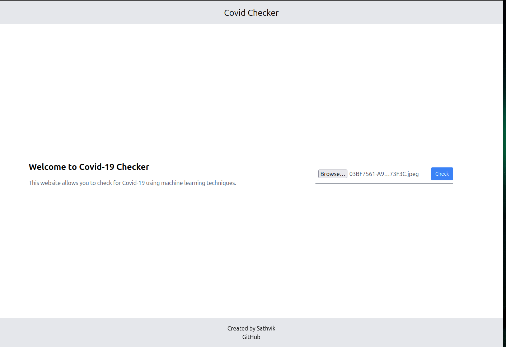
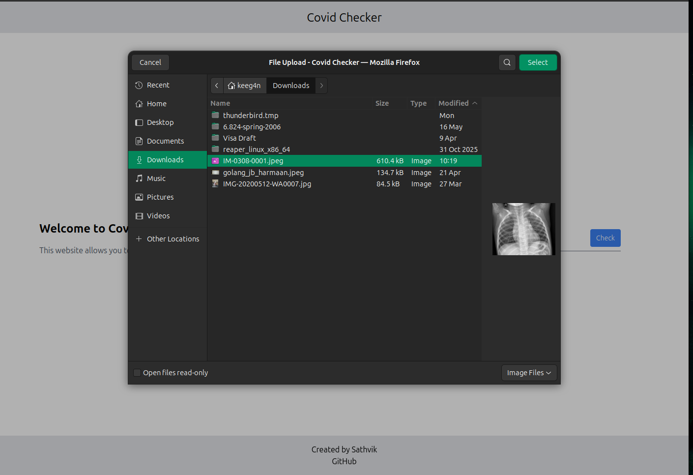
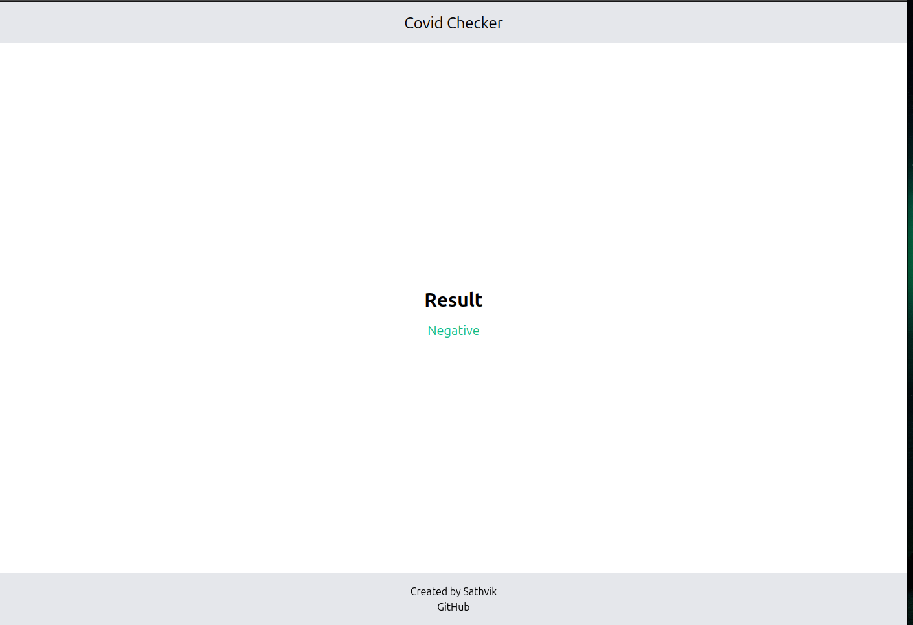
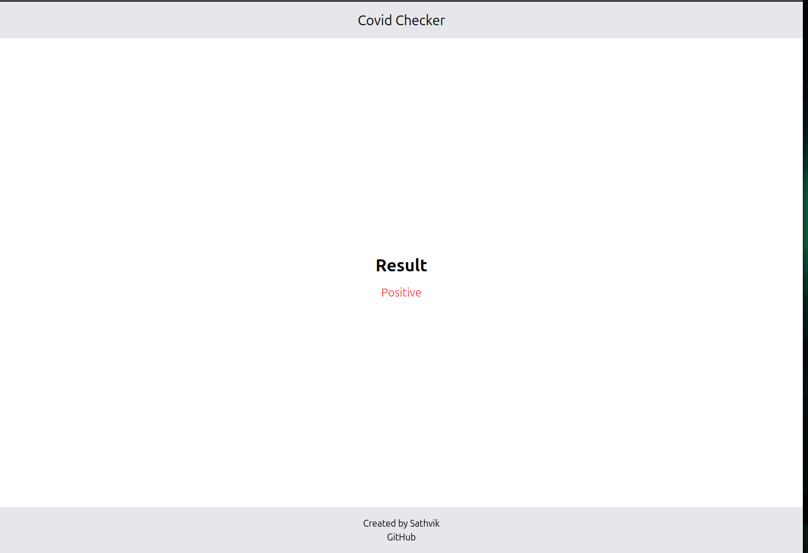

# COVID-19 Detection Using Chest X-Ray Images

[](https://colab.research.google.com/drive/1dBV0oP1ICT7HoC2kaOKT-5Iw33pv8fPU?usp=sharing)

> Click the badge above to open the notebook in Google Colab, train the model, and download `model.h5`.

A deep learning project that trains a Convolutional Neural Network (CNN) to classify chest X-ray images into three categories: **COVID-19**, **Normal**, and **Virus (Non-COVID Pneumonia)**. The trained model is served through a Flask web application where users can upload a chest X-ray and receive an instant prediction.

> Mini-Project Report — Bachelor of Engineering in Computer Science & Engineering  
> MVJ College of Engineering, Bangalore | Academic Year 2023-24  
> **Author:** T. Sathvik (1MJ20CS220) | **Guide:** Mrs. Swasti Sudha, Asst. Professor, Dept. of CSE

---

## Abstract

Artificial Intelligence and the Data Science community have contributed significantly to the global response against COVID-19. This project presents a custom CNN model trained in a transfer-learning-inspired setup for COVID-19 detection from chest X-ray images. The model distinguishes between COVID-19 positive cases, normal (healthy) chests, and viral (non-COVID) pneumonia cases, achieving an overall accuracy of **94%**.

---

## Dataset

- **Source:** [COVID CXR Image Dataset (Research)](https://www.kaggle.com/datasets/sid321axn/covid-cxr-image-dataset-research) on Kaggle (IEEE COVID-19 chest X-ray images)
- **Classes:**
  | Class  | Images |
  |--------|--------|
  | COVID  | 536    |
  | Normal | 668    |
  | Virus  | 619    |
- Images are resized to **224 × 224** pixels and normalised to `[0, 1]`.
- **Train / Test split:** 80% / 20% (random state = 42)

---

## Model Architecture

A custom Sequential CNN with three convolutional blocks followed by fully-connected layers:

| Layer Block | Details |
|---|---|
| Block 1 | Conv2D(32) × 2 → ReLU → MaxPool2D(2,2) |
| Block 2 | Conv2D(64) × 2 → ReLU → MaxPool2D(2,2) |
| Block 3 | Conv2D(128) × 2 → ReLU → MaxPool2D(2,2) × 2 |
| FC Layers | Flatten → Dense(1024) → Dense(256) → Dense(3, softmax) |
| Optimizer | Adam |
| Loss | Categorical Cross-Entropy |
| Epochs / Batch | 15 / 32 |

---

## Results

**Overall Accuracy: 94%**

| Class  | Precision | Recall | F1-Score | Support |
|--------|-----------|--------|----------|---------|
| COVID  | 0.97      | 0.95   | 0.96     | 108     |
| Normal | 0.89      | 0.97   | 0.93     | 129     |
| Virus  | 0.90      | 0.89   | 0.92     | 128     |
| **Weighted Avg** | **0.94** | **0.94** | **0.94** | **365** |

**Confusion Matrix:**

|        | Pred: COVID | Pred: Normal | Pred: Virus |
|--------|-------------|--------------|-------------|
| COVID  | 103         | 3            | 2           |
| Normal | 1           | 125          | 3           |
| Virus  | 2           | 12           | 114         |

---

## System Architecture

```
Training X-ray Images ──┐
                         ├──► CNN Training ──► Trained Model ──► Classification ──► COVID-19 Pos/Neg
Pretrained CNN Models ──┘                                  ▲
                                           Test X-ray Images ──┘
```

---

## Tech Stack

| Category | Tools |
|---|---|
| Language | Python |
| Deep Learning | TensorFlow, Keras |
| Image Processing | OpenCV (cv2) |
| Data Handling | NumPy, Pandas |
| Visualisation | Matplotlib |
| ML Utilities | scikit-learn |
| Web Framework | Flask |
| Training Environment | Google Colab |

---

## Requirements

### Hardware
- Processor: Intel i7 6600u or above
- RAM: 16 GB or above
- Storage: 1 TB or above

### Software
- Python 3.8+
- See `requirements.txt` (or install manually):

```bash
pip install tensorflow keras opencv-python numpy pandas matplotlib scikit-learn flask
```

---

## Project Structure

```
covid19_detection/
├── app.py                  # Flask web application
├── model.h5                # Trained CNN model (generated after training)
├── covid19_detection.ipynb # Jupyter notebook (training pipeline)
├── templates/
│   ├── base.html
│   ├── index.html
│   ├── prediction.html
│   └── error.html
└── README.md
```

---

## Usage

### 1. Train the Model (Jupyter Notebook)

Open `covid19_detection.ipynb` in Google Colab or locally and run all cells. The notebook covers:
- Dataset download from Kaggle
- Data exploration and visualisation
- Preprocessing (resize, normalise, label encoding)
- CNN model definition, compilation, and training
- Evaluation (accuracy/loss curves, classification report, confusion matrix)
- Model saving as `model.h5`

### 2. Run the Web App

**Step 1 — Clone the repository**
```bash
git clone https://github.com/keeeg4n/covid19_detection.git
cd covid19_detection
```

**Step 2 — Create and activate a virtual environment**
```bash
python3 -m venv venv

# Linux / macOS
source venv/bin/activate

# Windows
venv\Scripts\activate
```

**Step 3 — Install dependencies**
```bash
pip install flask tensorflow opencv-python numpy
```

**Step 4 — Add the trained model**

Place `model.h5` (downloaded from Colab) into the project root folder.

**Step 5 — Run the app**
```bash
python app.py
```

**Step 6 — Open in browser**

Navigate to `http://127.0.0.1:5000`, upload a chest X-ray image, and click **Check**.

**Prediction labels:**
- `0` → COVID-19
- `1` → Normal
- `2` → Virus (Non-COVID Pneumonia)

---

## Screenshots

**Home Page — Upload a chest X-ray**



**File Selection**



**Result — Negative**



**Result — Positive**



---

## Applications

- **Early Detection:** Assists clinicians with preliminary COVID-19 screening from chest X-rays.
- **Triage & Screening:** Quickly prioritises high-risk patients for further testing.
- **Resource Allocation:** Helps hospitals allocate limited medical resources more efficiently.
- **Telemedicine:** Enables remote diagnostic support where in-person visits are impractical.

---

## Advantages & Limitations

**Advantages**
- Non-invasive and cost-effective compared to CT scans
- Rapid inference — results in seconds
- Achieves 94% accuracy across three classes

**Limitations**
- Generalisation may degrade on images from different equipment or populations
- Not a definitive diagnostic tool — RT-PCR confirmation is still required
- Model performance depends heavily on dataset quality and labelling consistency

---

## Acknowledgements

Special thanks to **Mrs. Swasti Sudha** (Guide), **Dr. Kiran Babu T.S** (HOD, CSE), and the management of **MVJ College of Engineering, Bangalore** for their support and guidance throughout this project.
